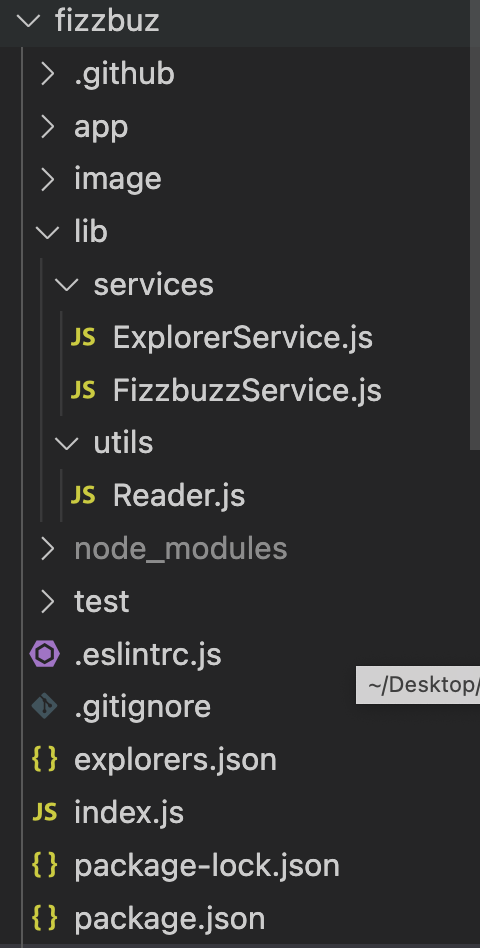
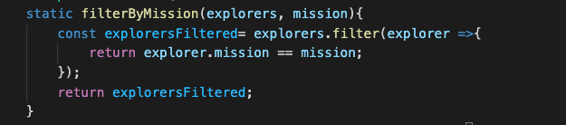
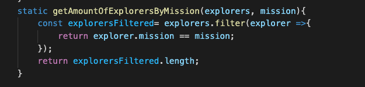
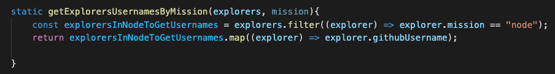
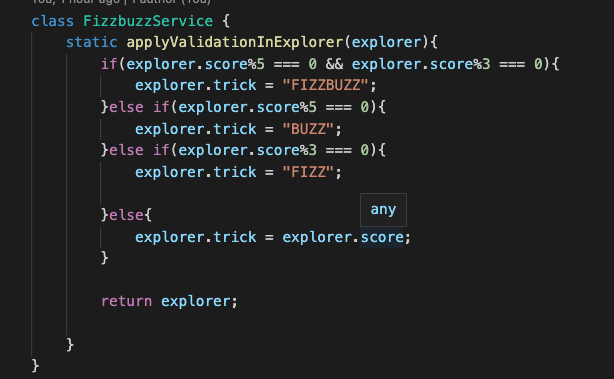

# Práctica: Fizzbuz

Práctica 1 - Semana 4 - Backend NodeJS - LaunchX.

### ***¿Qué es Fizzbuz?***

Fizz Buzz es un juego de palabras grupales para que los niños les enseñen sobre la división.
Los jugadores se turnan para contar de forma incremental, reemplazando cualquier número divisible por tres con la palabra "fizz", y cualquier número divisible por cinco con la palabra "buzz".

### ***Objetivo del proyecto.***

Refactorizando el código proporcionado para la práctica, cubrir las necesidades de los requerimientos enlistados, los cuales consisten en:

| FN. # | Descripción                                                                                                                                                                                                                                                                                                                                                                                                               | Cumplimiento dentro del código.                                                                                                                                                                                                                     |
| ----- | -------------------------------------------------------------------------------------------------------------------------------------------------------------------------------------------------------------------------------------------------------------------------------------------------------------------------------------------------------------------------------------------------------------------------- | ---------------------------------------------------------------------------------------------------------------------------------------------------------------------------------------------------------------------------------------------------- |
| 1     | Refactorizar el código legado en los siguientes determinantes: 1. Obtener la lista de explorers que solo están en node. 2. Obtener la cantidad de explorers en el curso de node. 3. Obtener la lista de los usuarios de github de los explorers. 4. Crear una validación para los explorers de Fizzbuzz, dejando  todo en una misma función en vez de validarlo de manera independiente. | 1. 2.  3.  4.  |
| 2.    | Creación de una API que consuma los servicios desarrollados.                                                                                                                                                                                                                                                                                                                                                              | En Proceso.                                                                                                                                                                                                                                          |

### ***Estructura del Proyecto.***

**fizzbuz** es la raíz del proyecto.

**app** es una carpeta en donde se encuentran almecenado el código funcional.

    - app.js : que continene todo el código a refactorizar en un servicio llamado
	ExplorerService y Fizzbuz Service

**test** es la carpeta en donde se almacenan las pruebas unitarias desarrolladas con *jest*.
**lib** es el folder en donde el código de app.js está refactorizado.

    -*services* : Carpeta en donde se almacenan los servicios requeridos para el aplicativo.

    -*utils*: Carpeta en donde se encuentran algunos utils, funciones, que se ocupan a lo largo

    del proyecto.

### Github Actions.

Adicionalmente, este proyecto implementa Github Actions, cuyo yml puede ser consultado en el directorio .github/workflows.

Dicho yml fue ajustado para la versión de node con la cual se desarrolló el proyecto (17.7.1) y la versión de jest compatible con esta misma. 

### **Dependencias**

Las dependencias instaladas en el proyecto se enlistan a continuación:

* ***express**:* es un framework escrito en JavaScript y alojado dentro del entorno de ejecución NodeJS que permite crear aplicaciones web.
* ***linter*:** es una herramienta enfocada en el proceso de "linting" para Javascript, examinando el mismo dado a unas normas y criterios que pueden ser personalizables.
* ***jest***: es un marco de prueba para Javascript que permite el desarrollo de pruebas dentro de las aplicaciones.
